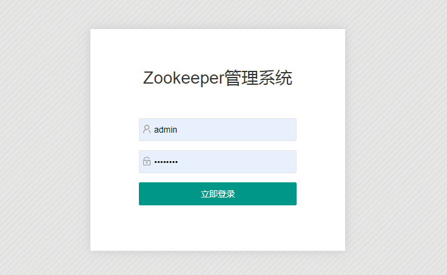
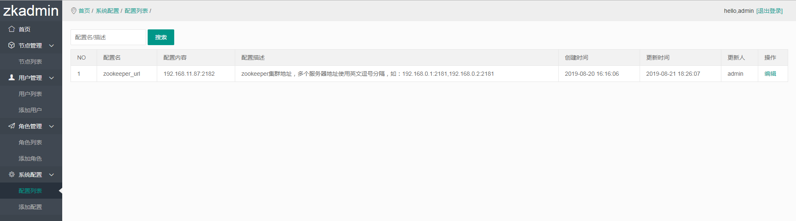
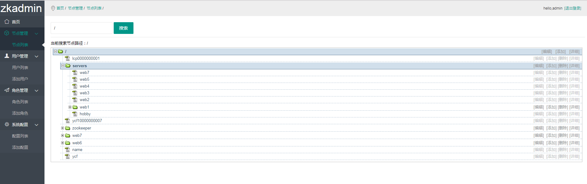
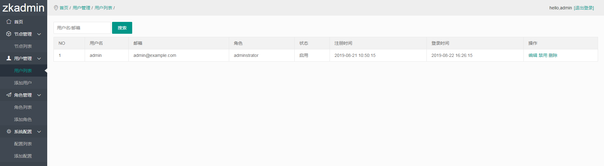
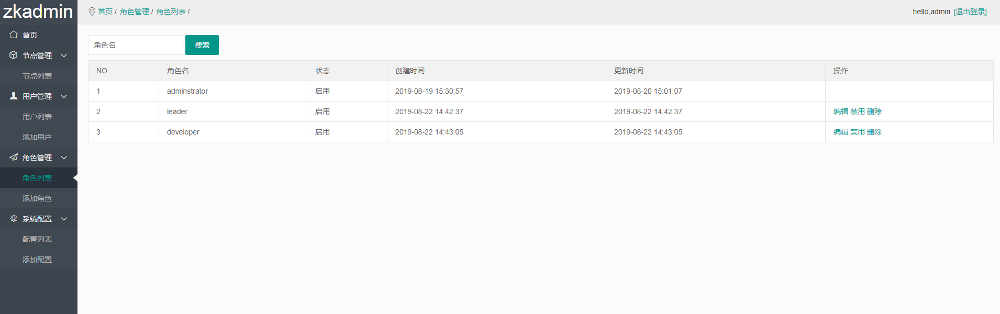

# php-zookeeper-admin
基于PHP语言编写的web版zookeeper管理系统，简称zkadmin

### 功能实现
1. 简易的zookeeper节点的增删改查操作
2. 灵活的角色权限管理

### 一、安装
环境依赖：
1. nginx
2. php >= 7.1
3. mysql >= 5.6
4. zookeeper扩展

根据上述的依赖搭建web环境（网上很多教程，这里就不再叙述）

### 二、使用
#### 1.下载 https://github.com/pupilcp/php-zookeeper-admin.git 项目代码

#### 2.初始化数据库相关
① 安装目录下：/application/config/database.php文件
```
$db['default'] = [
    'dsn'	       => 'mysql:host=数据库ip:数据库端口;dbname=数据库名', #此处需要修改
	'username'     => '数据库连接用户名', #此处需要修改
	'password'     => '数据库连接密码',  #此处需要修改
    'dbdriver'     => 'pdo',
    'dbprefix'     => '',
    'pconnect'     => false,
    'db_debug'     => (ENVIRONMENT !== 'production'),
    'cache_on'     => false,
    'cachedir'     => '',
    'char_set'     => 'utf8',
    'dbcollat'     => 'utf8_general_ci',
    'swap_pre'     => '',
    'encrypt'      => false,
    'compress'     => false,
    'stricton'     => false,
    'failover'     => [],
    'save_queries' => true,
];
```
② 初始化数据，将安装目录下：/application/config/zkadmin.sql文件导入数据库

#### 3.由于系统使用的是PHP的ci框架搭建，请在nginx的虚拟机配置文件增加以下规则以便url重写：
```
location / {
    if (!-e $request_filename) {
        rewrite ^(.*)$ /index.php?s=/$1 last;
    }
}
```
然后重启nginx生效，假设虚拟机配置的域名为：zkadmin.local.com

#### 4.访问zkadmin系统
① 浏览器打开：http://zkadmin.local.com ，成功安装:


② 默认登录账号密码，用户名：admin  密码：12345678

③ 成功登录后，请配置zookeeper服务地址


### 三、功能截图






### 四、备注
1. 角色权限修改后，重新登录立即生效，或者稍等5分钟，系统自动刷新登录用户的权限。

### 五、其它
如有疑问，请邮件联系：310976780@qq.com

